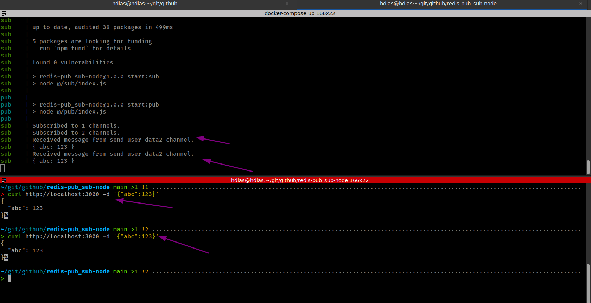

# redis-pub_sub-node
Redis Pub/Sub with Node.js

### [Tutorial](https://dev.to/franciscomendes10866/using-redis-pub-sub-with-node-js-13k3)

# Requirements
1. docker
2. docker-compose
3. node
4. curl
# Run
```sh
docker-compose up
```
```sh
# In another terminal
curl http://localhost:3000 -d '{"abc":123}'
```


# References
* [Tutorial](https://dev.to/franciscomendes10866/using-redis-pub-sub-with-node-js-13k3)